This tutorial simulates using unsteady potential flow theory, an
airfoil in constant freestream at a constant angle of attack.

The simulation can be run by entering in the julia prompt from the
current directory,

```
include("simRun.jl")
```

The simulation parameters are input in simRun.jl as follows. First,
the UnsteadyFlowSolvers library is loaded

```
using UnsteadyFlowSolvers
```

Motion kinematics for the airfoil are to be defined in term of pitch
(rotation), plunge/heave (vertical translation) and surge (horizontal
translation). The documentation for type `MotionDef` will show all available
kinematic definitons.

```
?MotionDef
```

Here, we define a constant pitch angle of 5 deg, no plunge, and a
constant freestream velocity.

```
alphadef = ConstDef(5. *pi/180)
hdef = ConstDef(0.)
udef = ConstDef(1.)
full_kinem = KinemDef(alphadef, hdef, udef)
```

The surface is defined in terms of it's kinematics and geometry and a
2D flowfield is initialised for the simulation. The airfoil properties
- geometry and pitch axis location are to be provided. A flat plat can
be defined, or a custom geometry from a coordinate file in the working
directory. The coordinates must be in XFOIL format (trailing edge ->
lower surface -> leading edge -> upper surface -> trailing edge) with
no headers (starting directly from coordinates).

```
pvt = 0.25
geometry = "FlatPlate"
surf = TwoDSurf(geometry, pvt, full_kinem)
curfield = TwoDFlowField()
```

The simulation time step for typical kinematics can be calculated
using the `find_tstep(kin::MotionDef)` function. The total run time is
defined using the number of time steps.

```
dtstar = find_tstep(alphadef)
t_tot = 10.
nsteps =Int(round(t_tot/dtstar))+1
```

`writeflag=1` is used to write the simulation details (vortex
strengths and locations) at a frequency defined using
`writeInterval`. `startflag=1` can be used to restart and continue a
simulation which is not used here. Vortex count control can be
implemented but is not used here, so `delNone()` is provided.

```
startflag = 0
writeflag = 1
writeInterval = t_tot/10.
delvort = delNone()
```

Finally, the input parameters are provided to the unsteady solver
function `lautat`. An unsteady, time-accurate
potential flow solution is found using the Large-Angle Unsteady Thin
Airfoil Theory, with free wake rollup implemented. The theory is
described in Ramesh, K. et al., "An unsteady airfoil theory applied to
pitching motions validated against experiment and computation",
Theor. Comput. Fluid Dyn. (2013) 27:
843. [Weblink](https://doi.org/10.1007/s00162-012-0292-8)

`lautatRoll` returns a matrix containing time variation of simulation
variables, and the final surface and flowfield data structures at the
end of the simulation. The time variation of simulation variables is
also written as a file to the current directory, *resultsSummary*.

```
mat, surf, curfield = lautat(surf, curfield, nsteps, dtstar,startflag, writeflag, writeInterval, delvort, wakerollup=1)
```

`makeForcePlots2D()` can be used to create plots of the time variation
of force coefficients during the simulation; they are written to a
directory *forcePlots*. `makeVortPlots2D()` can be used to create
vorticity maps from output timestamp directories (written to
*vortPlots*). This can be used only if `writeflag=1` was used and data
directories exist in the current directory. PyPlot libraries will need
to be configured correctly on your system. `cleanWrite()` clear all
timestamp directories from the current directory.

```
makeForcePlots2D()
makeVortPlots2D()
cleanWrite()
```

The time variation plots (of pitch angle and force coefficients) from
this simulation are shown below.

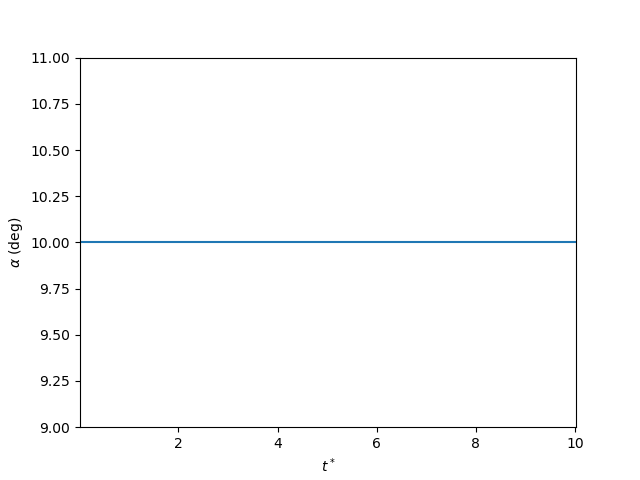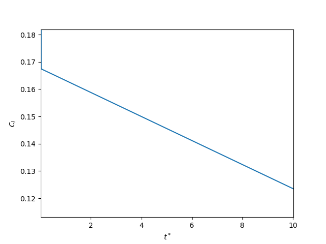
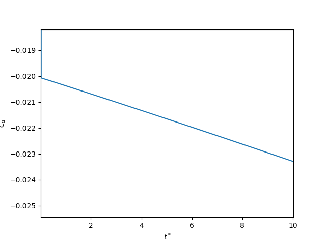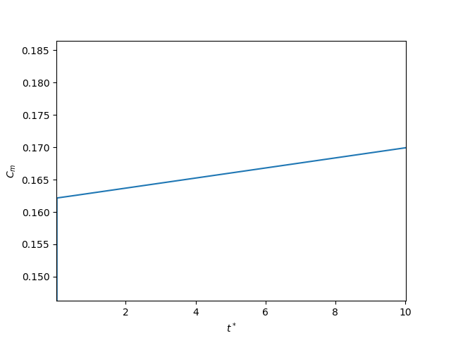

Vortex map plots from this simulation are shown below.

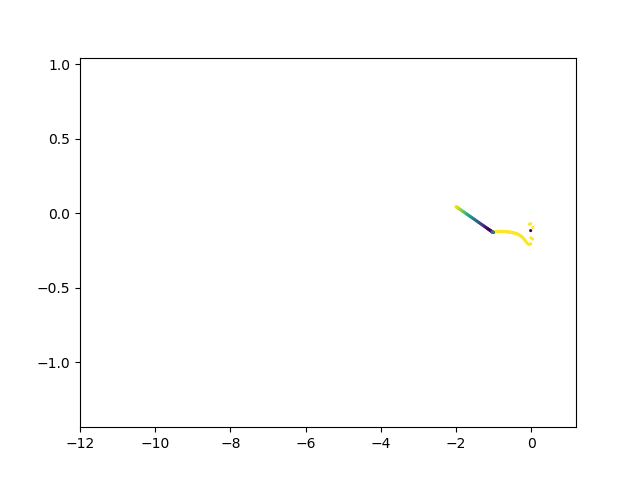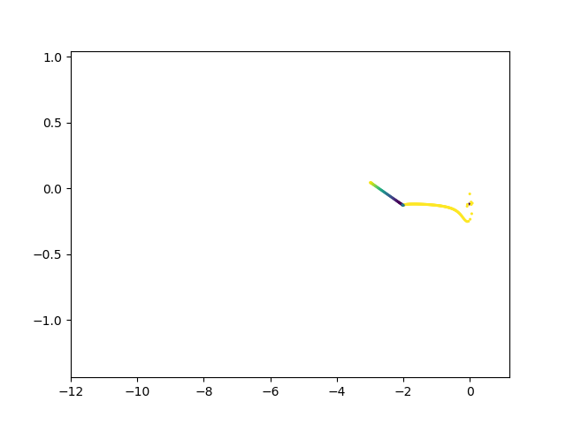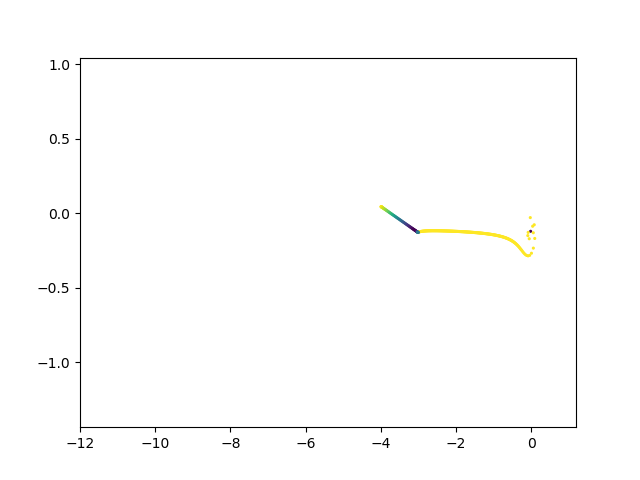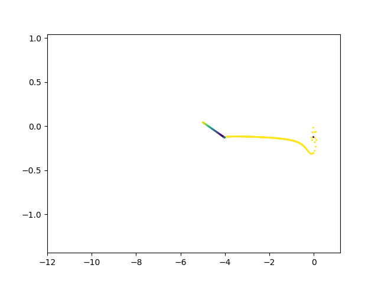

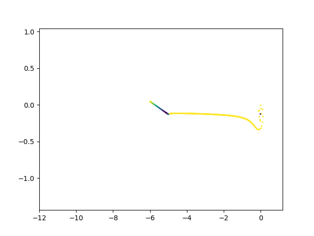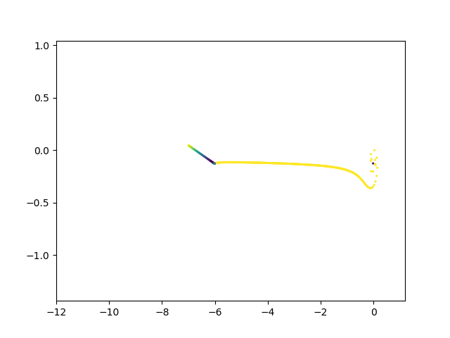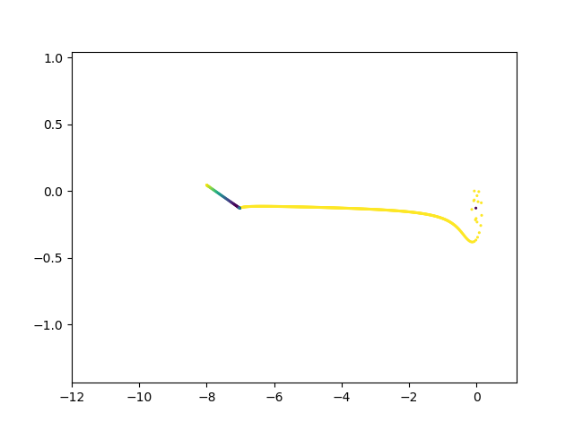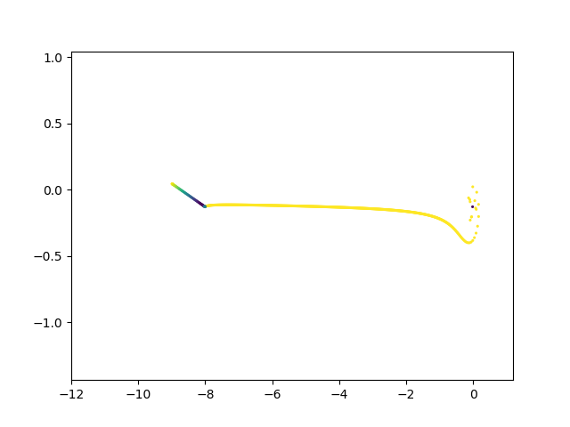

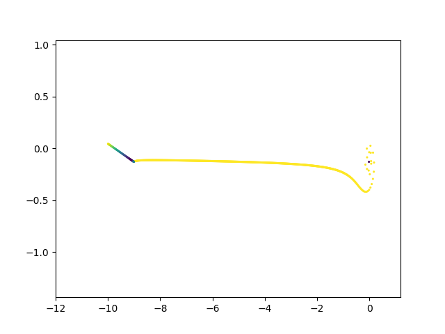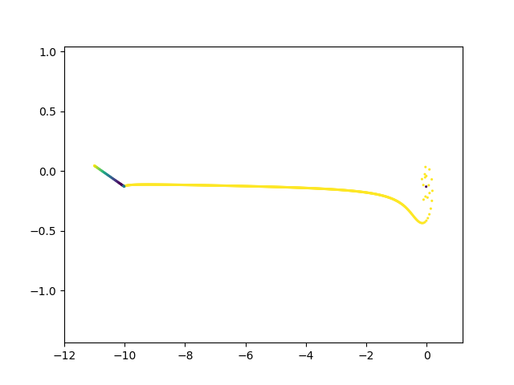

