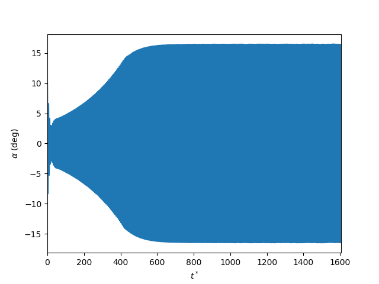
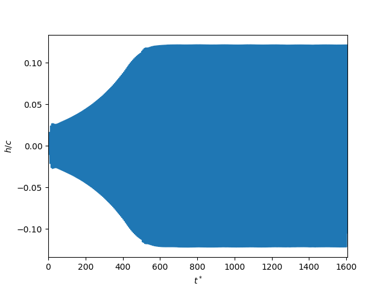

This tutorial simulates an aeroelastic system - an airfoil constrained by rotational 
and translational springs, and subject to constant freestream. The aerodynamic solution 
is obtained with unsteady potential flow theory augmented with leading-edge vortex shedding. 
The theory is described in Ramesh, K. et al., "Limit-cycle oscillations in unsteady flows 
dominated by intermittent leading-edge vortex shedding", J. Fluids and Structures
(2015) 55: 84-105. [Weblink](https://doi.org/10.1016/j.jfluidstructs.2015.02.005)

Refer to the *steadyAirfoil* for general guideline in setting up the kinematics, 
surface and solver definitons. 

The simulation can be run by entering in the julia prompt from the
current directory,

```
include("simRun.jl")
```

The initial conditions for airfoil position and velocity, and the freestream velocity are
provided to define the kinematics. 

```
push!(LOAD_PATH,"../../src/")
using UNSflow

alpha_init = 10*pi/180
alphadot_init = 0.
h_init = 0.
hdot_init = 0.
u = 0.467
udot = 0
kinem = KinemPar2DOF(alpha_init, h_init, alphadot_init, hdot_init, u)
```

Structural parameters for the aeroelastic system are provided. 

```
x_alpha = 0.05
r_alpha = 0.5
kappa = 0.05
w_alpha = 1.
w_h = 1.
w_alphadot = 0.
w_hdot = 0.
cubic_h_1 = 1.
cubic_h_3 = 0.
cubic_alpha_1 = 1.
cubic_alpha_3 = 0.
strpar = TwoDOFPar(x_alpha, r_alpha, kappa, w_alpha, w_h, w_alphadot, w_hdot, cubic_h_1, cubic_h_3, cubic_alpha_1, cubic_alpha_3)
```

A flat plate airfoil is defined. 

```
pvt = 0.35
geometry = "FlatPlate"
lespcrit = [0.11;]
c = 1.0
surf = TwoDSurf2DOF(c, u, geometry, pvt, strpar, kinem, lespcrit)
curfield = TwoDFlowField()
```

The aim is to run for long time until a steady condition is reached. So `nsteps` 
is set to a large value. 

```
dtstar = 0.015
nsteps = 50000
```

`writeflag` is set off. Vortex count control through merging is implemented using 
Spalart's algortihm.  

```
startflag = 0
writeflag = 0
delvort = delSpalart(500, 12, 1e-5)

mat, surf, curfield = ldvm(surf, curfield, nsteps, dtstar,startflag, writeflag, writeInterval, delvort)

makeForcePlots2D()
```

The time variation plots of pitch angle and plunge displacement for the self-sustained 
oscillation of the airfoil are shown below. 




