This tutorial simulates using potential flow theory an airfoil in
constant freestream at a constant angle of attack and undergoing sinusoidal plunge.

Refer to the *steadyAirfoil* for general guideline in setting up the kinematics, 
surface and solver definitons. 

The simulation can be run by entering in the julia prompt from the
current directory,

```
include("simRun.jl")
```

Here, we define a constant pitch angle of 4 deg, sinusoidal plunge, and a
constant freestream velocity. The `SinDef(mean, amp, k, phi)` takes arguments mean 
value of plunge displacement, amplitude of oscillation, reduced frequency and phase 
angle in radians. The reduced frequency is defined as $k=\omega*c/(2*u)$ where $\omega$ 
is frequency in rad/s, $c$ is chord length and $u$ is freestream velocity.

```
push!(LOAD_PATH,"../../src/")
using UNSflow

alphadef = ConstDef(4.*pi/180)
hdef = SinDef(0., 0.05, 3.93, 0.)
udef = ConstDef(1.)
full_kinem = KinemDef(alphadef, hdef, udef)
```

An SD7003 airfoil is defined with the coordinate file provided in working directory. 

```
pvt = 0.25
geometry = "sd7003.dat"
surf = TwoDSurf(geometry, pvt, full_kinem)
curfield = TwoDFlowField()
```

The `find_tstep` function is used with `hdef` as the input since the 
oscillation determines the time step of the problem. The total run time
is calculated as 5 cycles of oscillation. 

```
dtstar = find_tstep(hdef)
t_tot = 5.*pi/hdef.k
nsteps =Int(round(t_tot/dtstar))+1
```

`writeInterval` is set so that 20 time instants are written 
for creating the vorticity plots. 

```
startflag = 0
writeflag = 1
writeInterval = t_tot/20.
delvort = delNone()

mat, surf, curfield = lautatRoll(surf, curfield, nsteps, dtstar,startflag, writeflag, writeInterval, delvort)

makeForcePlots2D()
makeVortPlots2D()
cleanWrite()
```

The time variation plots (of pitch angle and force coefficients) from
this simulation are shown below.

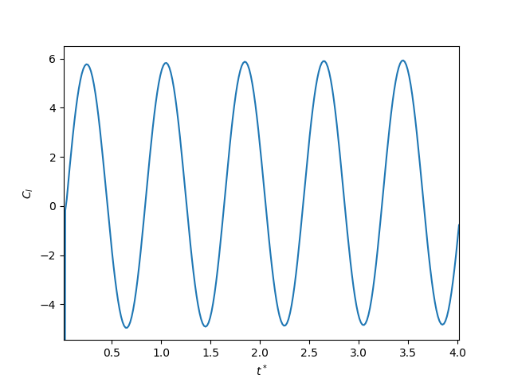
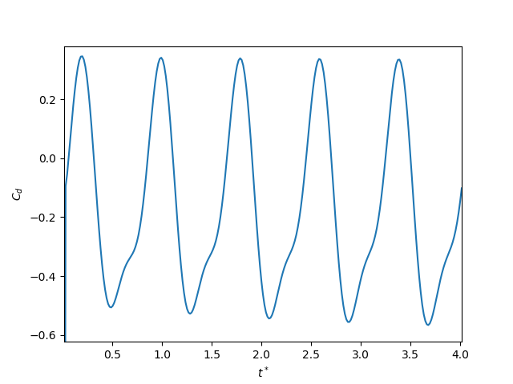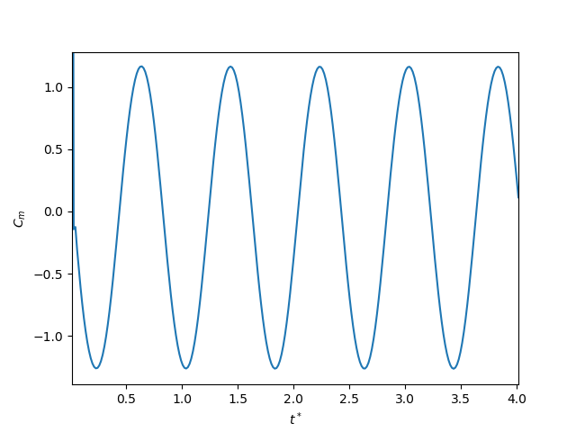

Vortex map plots from this simulation are shown below.

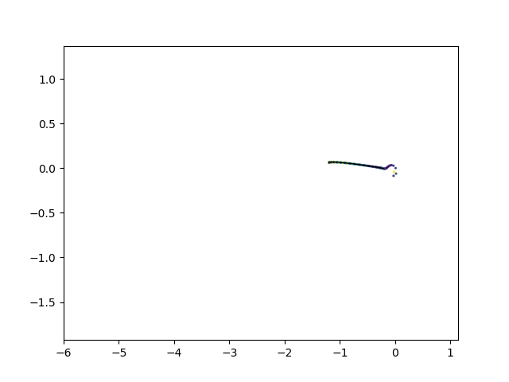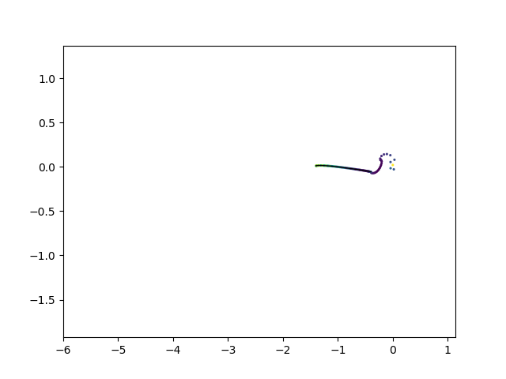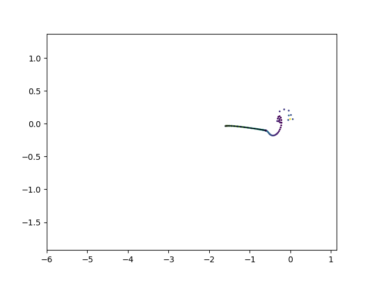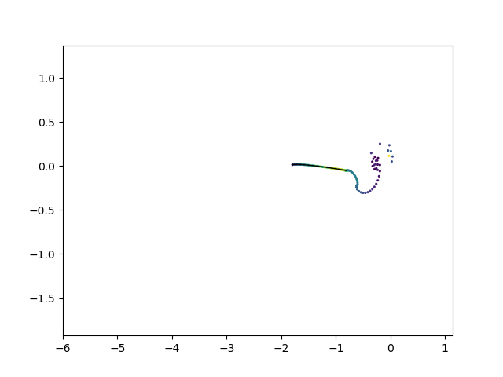

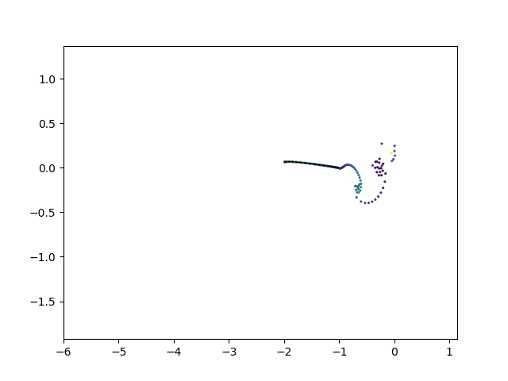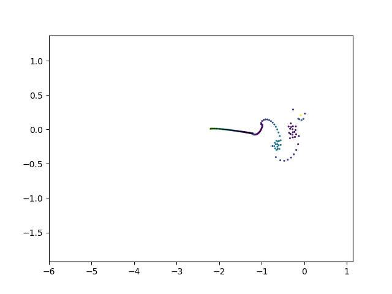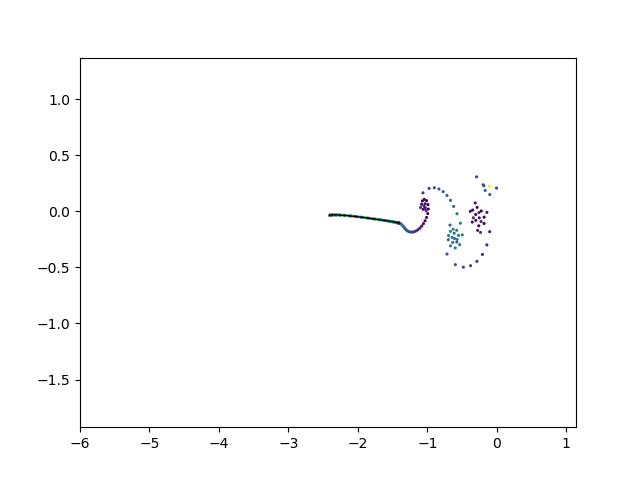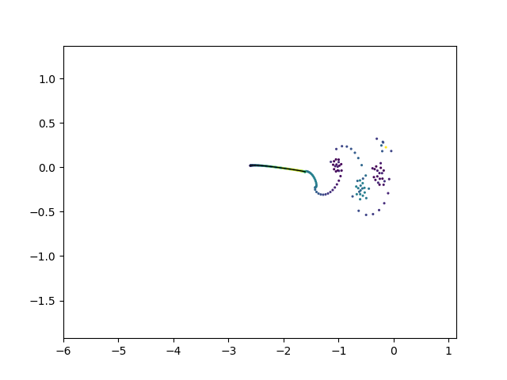

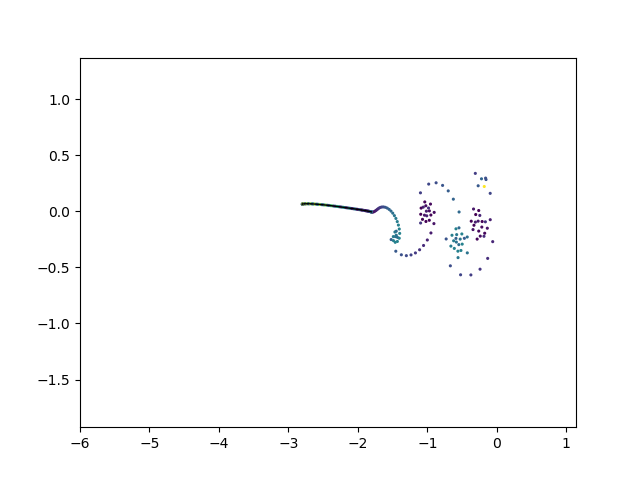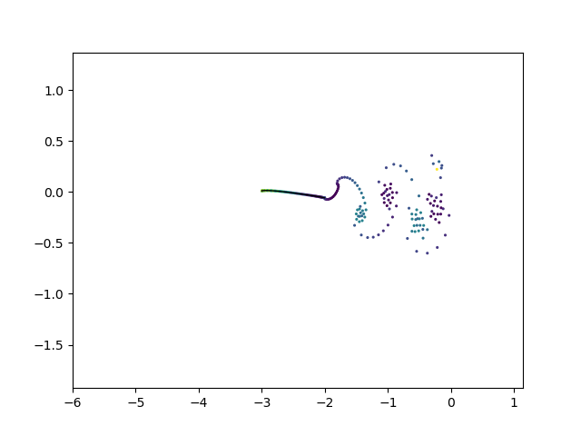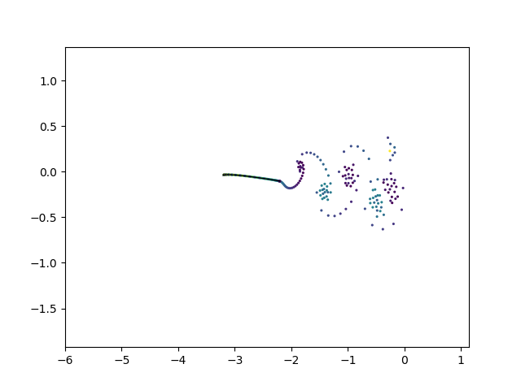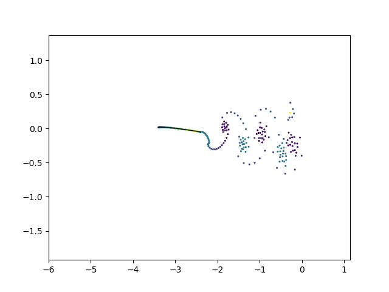

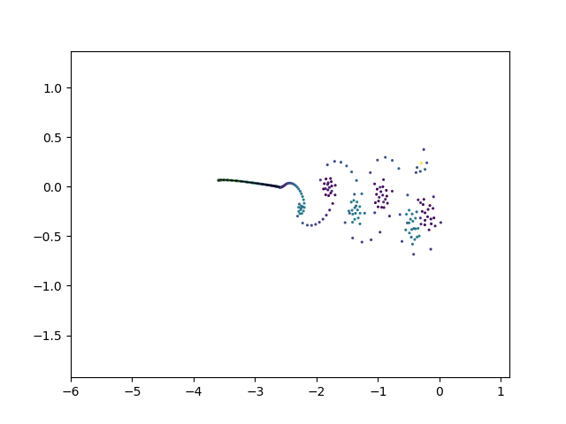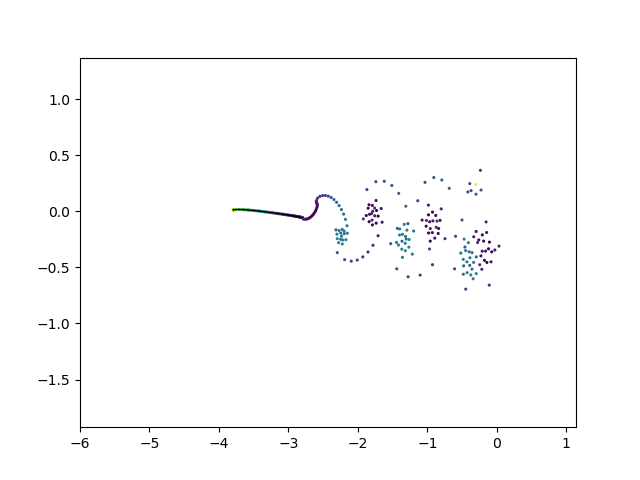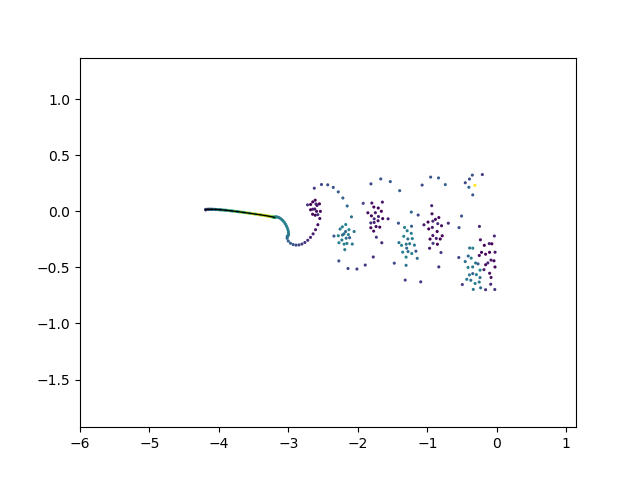

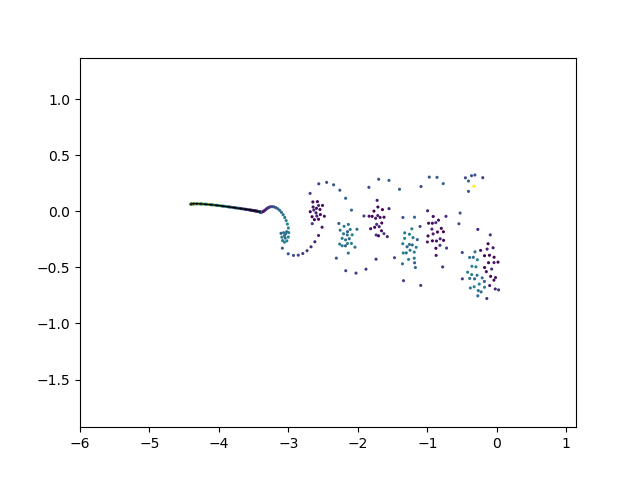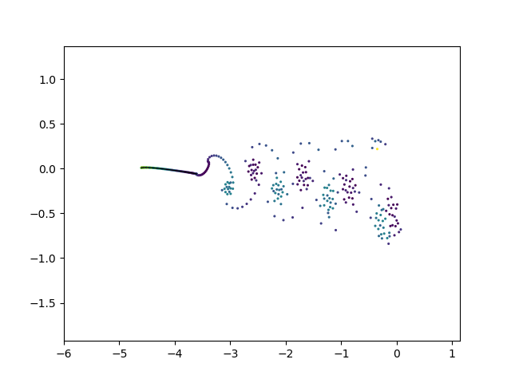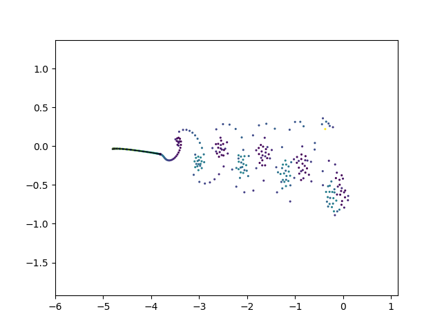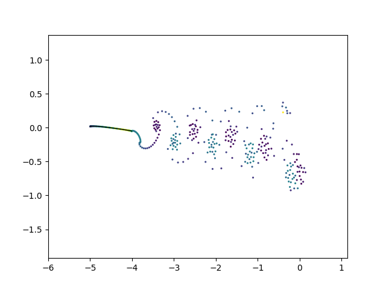


