This tutorial simulates using an airfoil pitching up to 45 degrees using potential 
flow theory augmented with vortex shedding from the leading edge. The leading edge 
vortex (LEV) shedding is determined and controlled using the LESP parameter. The theory 
and this simulation are presented in Ramesh, K. et al., "Discrete-vortex method with
novel shedding criterion for unsteady aerofoil flows with intermittent leading-edge 
vortex shedding", J. Fluid Mech. (2014) 751: 500-538. [Weblink](https://doi.org/10.1017/jfm.2014.297)

Refer to the *steadyAirfoil* for general guidelines on setting up the kinematics, 
surface and solver definitons. 

The simulation can be run by entering in the julia prompt from the
current directory,

```
include("simRun.jl")
```

Here, we define the pitch ramp kinematics using the Eldredge function
(details in paper above). The `EldUpDef(amp, K, a)` takes arguments 
amplitude of ramp, reduced frequency and smoothing parameter for the 
ramp corners (between 0-1). The reduced frequency is defined as $K=\dot{\alpha}*c/(2*u)$ 
where $\dot{\alpha}$ is pitch rate in rad/s, $c$ is chord length and
$u$ is freestream velocity.

```
using UnsteadyFlowSolvers

alphadef = EldUpDef(45.*pi/180, 0.4, 0.8)
hdef = ConstDef(0.)
udef = ConstDef(1.)
full_kinem = KinemDef(alphadef, hdef, udef)

```

An flat plate is defined with pivot location at the leading edge. To predict 
and modulate vortex shedding, the LESPcrit parameter must be provided which 
doesn't depend on the kinematics but depends on the airfoil shape and Reynolds number. 
For a flat plate at Re=1,000, LESPcrit = 0.11 has been predetermined (refer paper above).  

```
pvt = 0.0
geometry = "FlatPlate"
lespcrit = [0.11;]
surf = TwoDSurf(geometry, pvt, full_kinem, lespcrit)
curfield = TwoDFlowField()
```

The `find_tstep` function is used with `alphadef` as the input since the 
ramp determines the time step of the problem. The total run time
is set so that the plate stays at 45 deg for some time after the end of ramp.
`writeInterval` is set to approximately $0.5$. Here, the LDVM solver is used, 
which stands for LESP-modulated Discrete Vortex Method (refer paper above for details). 

```
dtstar = find_tstep(alphadef)
t_tot = 9.
nsteps =Int(round(t_tot/dtstar))+1

startflag = 0
writeflag = 1
writeInterval = t_tot/18.
delvort = delNone()

mat, surf, curfield = ldvm(surf, curfield, nsteps, dtstar,startflag, writeflag, writeInterval, delvort)

makeForcePlots2D()
makeVortPlots2D()
cleanWrite()
```

The time variation plots (of pitch angle and force coefficients) from
this simulation are shown below.

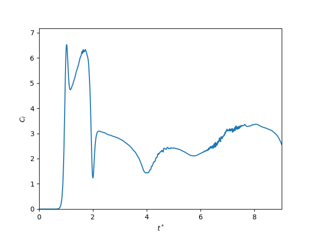
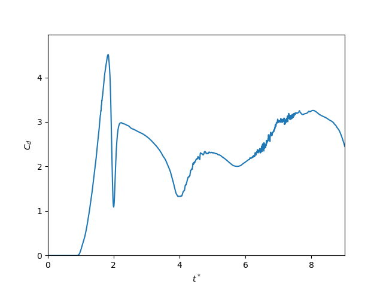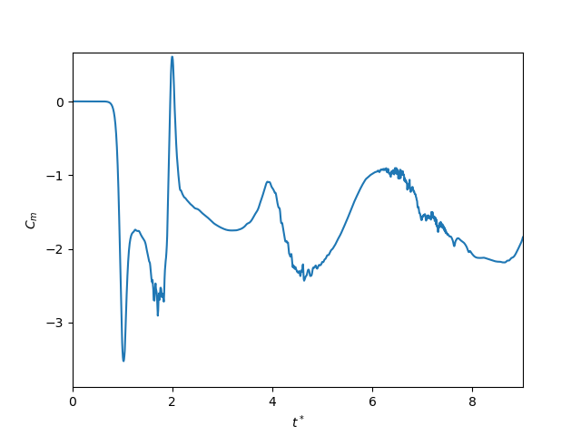

Vortex map plots from this simulation are shown below.

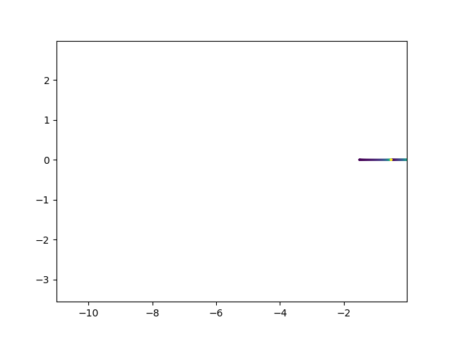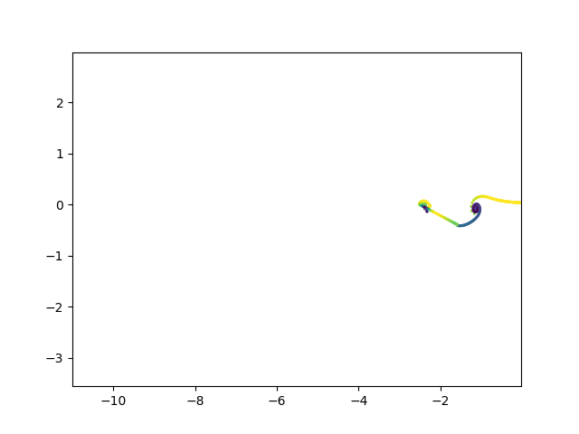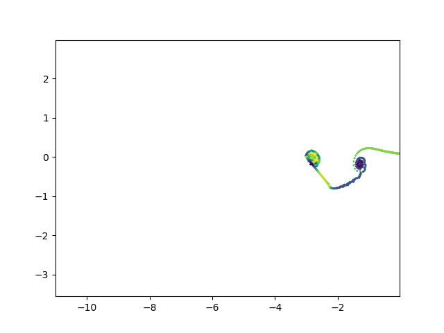

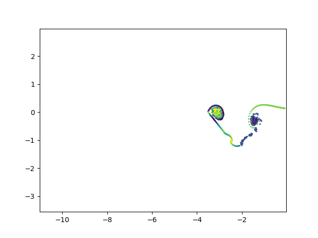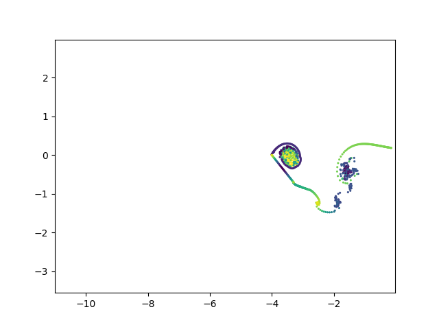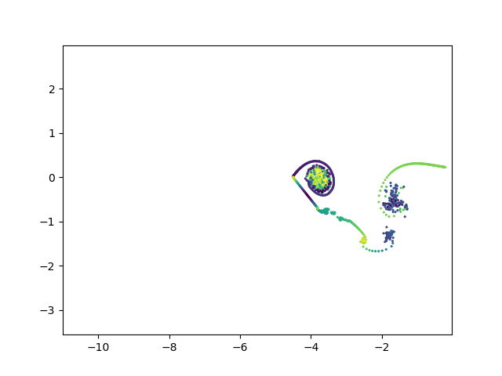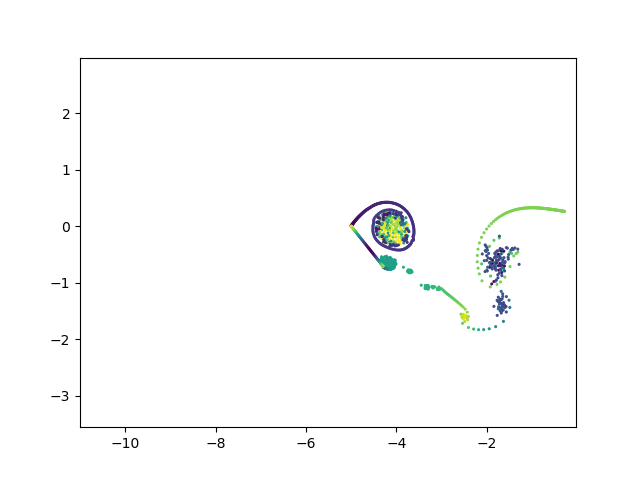

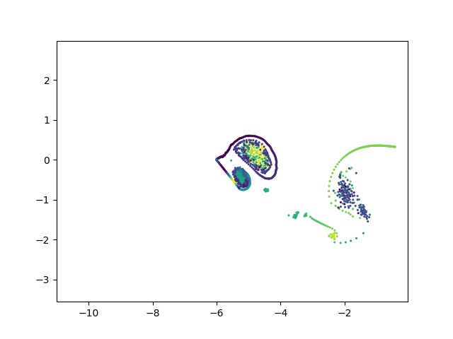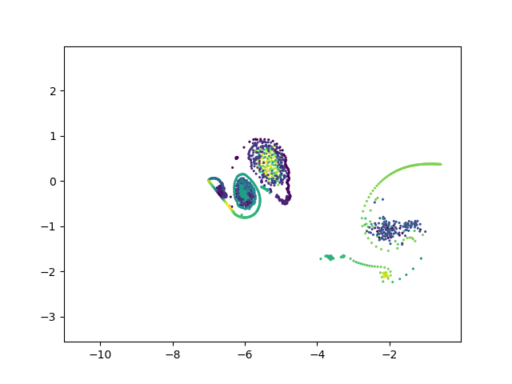

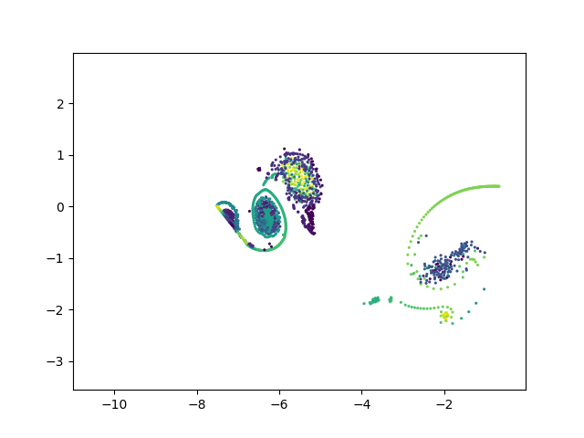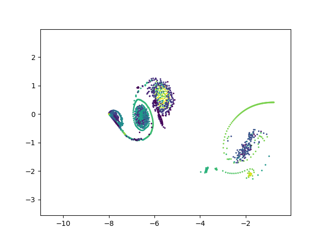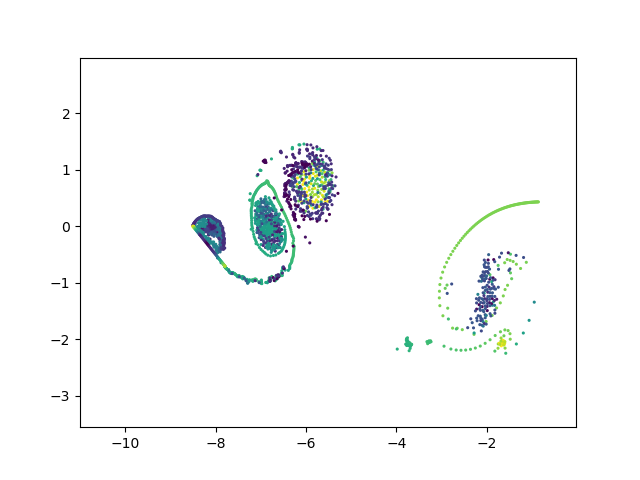

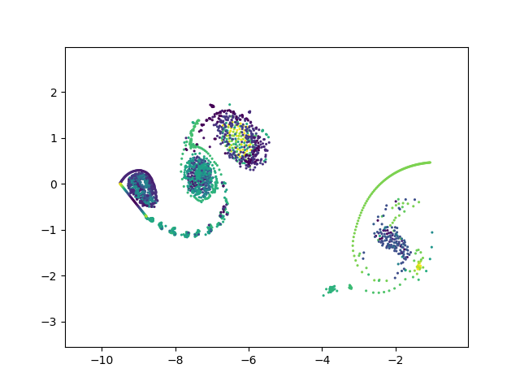


